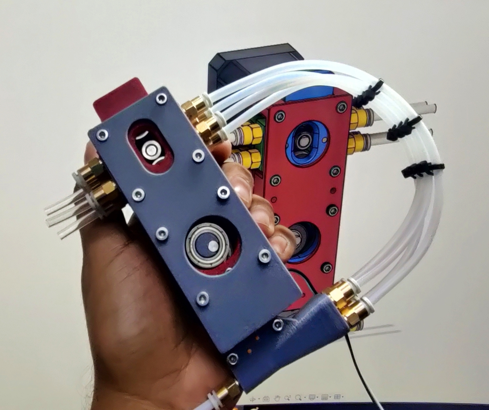

# TetraFlow_MMU

*TetraFlow MMU*: A Multi-Material Unit for 3D Printers

TetraFlow MMU is a 4-color MMU inspired by the innovative 3dChameleon MMU. Utilizing a unique cam design, it seamlessly switches between filaments. The compact and simple design, thanks to the cam mechanism, includes a 4-to-1 Y splitter with an integrated filament sensor. Additionally, the MMU features homing functionality for precise and reliable filament switching.

    

This is the initial design undergoing refinements. The integration code for 3D printers is still under development.

    

# Demo Video

   

